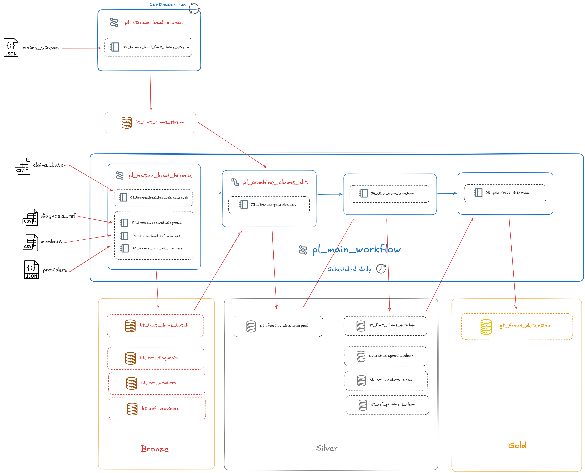

# medisure_dbk
A capstone project for the "Data Engineering with Databricks" training. 
This project implements a **Databricks Lakehouse architecture** for healthcare claims data, applying the **Medallion architecture** (Bronze, Silver, Gold) with a focus on **data quality, compliance, and fraud detection**.

### Architecture Design

